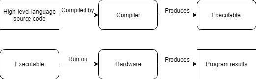

# <https://www.learncpp.com/>

## Chapter 0 Introduction / Getting Started

### [0.1 Introduction to these tutorials](https://www.learncpp.com/cpp-tutorial/introduction-to-programming-languages/)

### [0.2 Introduction to programming languages](https://www.learncpp.com/cpp-tutorial/introduction-to-programming-languages/)

- A computer program (also commonly called an application) is a set of instructions that the computer can perform in order to perform some task.
- The process of creating a program is called programming.
- Programmers typically create programs by producing source code (commonly shortened to code), which is a list of commands typed into one or more text files.
- The collection of physical computer parts that make up a computer and execute programs is called the **hardware**.
- When a computer program is loaded into memory and the **hardware** sequentially executes each instruction, this is called running or executing the program.
- The limited set of instructions that a CPU can understand directly is called **machine code** (or machine language or an instruction set). 10110000 01100001.
- First, each instruction is composed of a sequence of 1’s and 0’s. Each individual 0 or 1 is called a binary digit, or **bit** for short.
- Because machine language is so hard for humans to read and understand, **assembly language** was invented. In an assembly language, each instruction is identified by a short abbreviation (rather than a set of bits), and names and other numbers can be used.
- To address the readability and portability concerns, new programming languages such as C, C++, Pascal (and later, languages such as Java, Javascript, and Perl) were developed. These languages are called **high level languages**.
- A **compiler** is a program that reads source code and produces a stand-alone executable program that can then be run.



- An **interpreter** is a program that directly executes the instructions in the source code without requiring them to be compiled into an executable first. Interpreters tend to be more flexible than compilers, but are less efficient when running programs because the interpreting process needs to be done every time the program is run.


- Most languages can be compiled or interpreted, however, traditionally languages like C, C++, and Pascal are compiled, whereas “scripting” languages like Perl and Javascript tend to be interpreted. Some languages, like Java, use a mix of the two.

### [0.3 Introduction to C/C++](https://www.learncpp.com/cpp-tutorial/introduction-to-cplusplus/)

C++ excels in situations where high performance and precise control over memory and other resources is needed. Here are a few common types of applications that most likely would be written in C++:

- Video games;
- Real-time systems (e.g. for transportation, manufacturing, etc…);
- High-performance financial applications (e.g. high frequency trading);
- Graphical applications and simulations;
- Productivity / office applications;
- Embedded software;
- Audio and video processing;

### [0.4 Introduction to C++ development](https://www.learncpp.com/cpp-tutorial/introduction-to-cpp-development/)


```C++
#include <iostream>

int main()
{
    std::cout << "Colored text!";
    return 0;
}
```

### [0.5 Introduction to the compiler, linker, and libraries](https://www.learncpp.com/cpp-tutorial/introduction-to-the-compiler-linker-and-libraries/)

- **Compiler** checks your code to make sure it follows the rules of the C++ language.
- **Compiler** translates your C++ source code into a machine language file called an **object file** - name.o or name.obj.


After the compiler creates one or more object files, then another program called the **linker** kicks in. The job of the linker is three fold:

1) Take all the object files generated by the compiler and combine them into a single executable program. 
2) In addition to being able to link object files, the linker also is capable of linking library files. A library file is a collection of precompiled code that has been “packaged up” for reuse in other programs.
3) The linker makes sure all cross-file dependencies are resolved properly. For example, if you define something in one .cpp file, and then use it in another .cpp file, the linker connects the two together. If the linker is unable to connect a reference to something with its definition, you’ll get a linker error, and the linking process will abort.

For complex projects, some development environments use a **makefile**, which is a file that describes how to build a program (e.g. which files to compile and link, or otherwise process in various ways).

### [0.6 Installing an Integrated Development Environment (IDE)](https://www.learncpp.com/cpp-tutorial/installing-an-integrated-development-environment-ide/)

- how to install an IDE;
  
### [0.7 Compiling your first program](https://www.learncpp.com/cpp-tutorial/writing-your-first-program/)

- A **console project** means that we are going to create programs that can be run from the Windows, Linux, or Mac console.
- How to create a program in different IDE's;

```g++ -o HelloWorld HelloWorld.cpp```

### [0.8 A few common C++ problems](https://www.learncpp.com/cpp-tutorial/a-few-common-cpp-problems/)

- General issues and compiling problemns - questions and answers;

### [0.9 Configuring your compiler: Build configurations](https://www.learncpp.com/cpp-tutorial/configuring-your-compiler-build-configurations/)

- A **build configuration** (also called a build target) is a collection of project settings that determines how your IDE will build your project.
- The **debug configuration** is designed to help you debug your program, and is generally the one you will use when writing your programs. This configuration turns off all optimizations, and includes debugging information, which makes your programs larger and slower, but much easier to debug.
- The **release configuration** is designed to be used when releasing your program to the public. This version is typically optimized for size and performance, and doesn’t contain the extra debugging information.
- Best practice: use the debug build configuration when developing your programs. When you’re ready to release your executable to others, or want to test performance, use the release build configuration.

### [0.10 Configuring your compiler: Compiler extensions](https://www.learncpp.com/cpp-tutorial/configuring-your-compiler-compiler-extensions/)

- Best practice: disable compiler extensions to ensure your programs (and coding practices) remain compliant with C++ standards and will work on any system.
- How to configure it in different IDE's;

### [0.11 Configuring your compiler: Warning and error levels](https://www.learncpp.com/cpp-tutorial/configuring-your-compiler-warning-and-error-levels/)

- Best practice: turn your warning levels up to the maximum, especially while you are learning. It will help you identify possible issues.
- Treat warnings as errors.
- Setting up the environment.

### [0.12 Configuring your compiler: Choosing a language standard](https://www.learncpp.com/cpp-tutorial/configuring-your-compiler-choosing-a-language-standard/)

- Setting language in different IDE's
- For GCC/G++, you can pass compiler flags -std=c++11, -std=c++14, -std=c++17, or -std=c++2a to enable C++11/14/17/2a support respectively.

## Chapter 1 C++ Basics

### [1.1 Statements and the structure of a program](https://www.learncpp.com/cpp-tutorial/statements-and-the-structure-of-a-program/)

- A **statement** is a type of instruction that causes the program to perform some action.
- A function is a collection of statements that executes sequentially.
- Every C++ program must have a special function named **main** (all lower case letters). When the program is run, execution starts with the first statement inside of function main and then continues sequentially.
- If you violate a rule, the compiler will complain when you try to compile your program, and issue you a **syntax error**.

### [1.2 Comments](https://www.learncpp.com/cpp-tutorial/comments/)

- A **comment** is a programmer-readable note that is inserted directly into the source code of the program. Comments are ignored by the compiler and are for the programmer’s use only.
- Comment your code liberally, and write your comments as if speaking to someone who has no idea what the code does. Don’t assume you’ll remember why you made specific choices.
- Comments can be used to describe how the code is going to accomplish its goal (not what).

### [1.3 Introduction to variables](https://www.learncpp.com/cpp-tutorial/introduction-to-variables/)

- Programs are collections of instructions that manipulate data to produce a desired result.
- All computers have memory, called **RAM** (short for random access memory), that is available for your programs to use. You can think of RAM as a series of mailboxes that can be used to hold data while the program is running. A single piece of data, stored in memory somewhere, is called a value.
- When the program is run (called runtime), the variable will be instantiated.
- Instantiation is a fancy word that means the object will be created and assigned a memory address.
- A **data type** (more commonly just called a type) tells the compiler what type of value (e.g. a number, a letter, text, etc…) the variable will store.

### [1.4 Variable assignment and initialization](https://www.learncpp.com/cpp-tutorial/variable-assignment-and-initialization/)

```c++
int x; // define an integer variable named x
int y, z; // define two integer variables, named y and z
```

After a variable has been defined, you can give it a value (in a separate statement) using the *= operator*. This process is called **copy assignment** (or just **assignment**) for short.

```C++
int width; // define an integer variable named width
width = 5; // copy assignment of value 5 into variable width

// variable width now has value 5
```

The *= operator* is called the **assignment operator**. *Assignment (=)* is used to assign a value to a variable. *Equality (==)* is used to test whether two operands are equal in value.

When a variable is defined, you can also provide an initial value for the variable at the same time. This is called **initialization**.

C++ supports **three** basic ways to initialize a variable. First, we can do **copy initialization** by using an equals sign:

```C++
int width = 5; // copy initialization of value 5 into variable width
```

Second, we can do **direct initialization** by using parenthesis.

```C++
int width( 5 ); // direct initialization of value 5 into variable width
```

For simple data types (like integers), copy and direct initialization are essentially the same. But **for some advanced types, direct initialization can perform better than copy initialization**.

Unfortunately, parenthesis-based direct initialization can’t be used for all types of initialization (such as initializing an object with a list of data). 
In an attempt to provide a more consistent initialization mechanism, C++11 added a new syntax called **brace initialization** (also sometimes called **uniform initialization**) that uses curly braces.

```C++
int width{ 5 }; // direct brace initialization of value 5 into variable width (preferred)
int height = { 6 }; // copy brace initialization of value 6 into variable height

int width{}; // zero initialization to value 0

int width{ 4.5 }; // error: not all double values fit into an int
```

These two forms function almost identically, but the direct form is generally preferred.

In the above snippet, we’re trying to assign a number (4.5) that has a fractional part (the .5 part) to an integer variable (which can only hold numbers without fractional parts). Copy and direct initialization would drop the fractional part, resulting in initialization of value 4 into variable width. However, with brace initialization, this will cause the compiler to issue an error (which is generally a good thing, because losing data is rarely desired).

**Best practice:** Favor **direct brace initialization** whenever possible.

```C++
int a = 5, b = 6; // copy initialization
int c( 7 ), d( 8 ); // direct initialization
int e{ 9 }, f{ 10 }; // brace initialization (preferred)

int a, b = 5; // wrong (a is not initialized!)
int a = 5, b = 5; // correct

int a, b( 5 ); // braces make the initialization more clear
int c, d{ 5 };
```

### [1.5 ]()

### [1.6 ]()

### [1.7 ]()

### [1.8 ]()