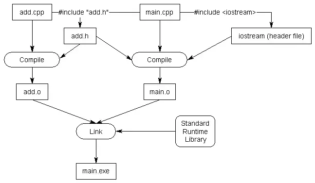

# Chapter 2 C++ Basics: Functions and Files

## [2.1  Introduction to functions](https://www.learncpp.com/cpp-tutorial/introduction-to-functions/)

- A **function** is a reusable sequence of statements designed to do a particular job.
- Functions that you write yourself are called **user-defined functions**.
- A **function call** is an expression that tells the CPU to interrupt the current function and execute another function. 
- The function initiating the function call is the **caller**, and the function being called is the **callee** or called function.

### An example of a user-defined function

```C++
returnType functionName() // This is the function header (tells the compiler about the existence of the function)
{
    // This is the function body (tells the compiler what the function does)
}
```

- The first line is informally called the **function header**, and it tells the compiler about the existence of a function...
- The curly braces and statements in-between are called the **function body**.

### Calling functions more than once

### Functions calling functions calling functions

### Nested functions are not supported

## [2.2 Function return values (value-returning functions)](https://www.learncpp.com/cpp-tutorial/function-return-values-value-returning-functions/)

### Return values

- The specific value returned from a function is called the **return value**.
- When the return statement is executed, the function exits immediately, and the return value is copied from the function back to the caller. This process is called **return by value**.

### Fixing our challenge program

```C++
#include <iostream>

int getValueFromUser() // this function now returns an integer value
{
 	std::cout << "Enter an integer: ";
	int input{};
	std::cin >> input;

	return input; // return the value the user entered back to the caller
}

int main()
{
	int num { getValueFromUser() }; // initialize num with the return value of getValueFromUser()

	std::cout << num << " doubled is: " << num * 2 << '\n';

	return 0;
}
```

### Revisiting main()

- ```main``` returns an integer value (usually 0), and your program terminates. The return value from ```main``` is sometimes called a **status code** (also sometimes called an **exit code**, or rarely a **return code**), as it is used to indicate whether the program ran successfully or not.
- <span style="color:green">**BEST PRACTICE**</span>: Your ```main``` function should return the value ```0``` if the program ran normally.

```C++
/* The C++ standard only defines the meaning of 3 status codes: 0, EXIT_SUCCESS, and EXIT_FAILURE. 0 and EXIT_SUCCESS both mean the program executed successfully. EXIT_FAILURE means the program did not execute successfully.

EXIT_SUCCESS and EXIT_FAILURE are preprocessor macros defined in the <cstdlib> header: */
#include <cstdlib> // for EXIT_SUCCESS and EXIT_FAILURE

int main()
{
    return EXIT_SUCCESS;
}
```

### A value-returning function that does not return a value will produce undefined behavior

- A function that returns a value is called a **value-returning function**. A function is value-returning if the return type is anything other than ```void```.
- <span style="color:green">**BEST PRACTICE**</span>: Make sure your functions with non-void return types return a value in all cases. Failure to return a value from a value-returning function will cause undefined behavior.

### Function main will implicitly return 0 if no return statement is provided

### Functions can only return a single value

### The function author can decide what the return value means

### Reusing functions

- <span style="color:green">**BEST PRACTICE**</span>: 
Follow the **DRY** best practice: **“don’t repeat yourself”**. If you need to do something more than once, consider how to modify your code to remove as much redundancy as possible.

### Conclusion

## [2.3 Void functions (non-value returning functions)](https://www.learncpp.com/cpp-tutorial/void-functions-non-value-returning-functions/)

### Void return values

-  To tell the compiler that a function does not return a value, a return type of **void** is used.
- A function that does not return a value is called a **non-value returning function** (or a **void function**).

### Void functions don’t need a return statement

```C++
#include <iostream>

// void means the function does not return a value to the caller
void printHi()
{
    std::cout << "Hi" << '\n';

    return; // tell compiler to return to the caller -- this is redundant since the return will happen at the end of the function anyway!
} // function will return to caller here

int main()
{
    printHi();

    return 0;
}
```
- <span style="color:green">**BEST PRACTICE**</span>: Do not put a return statement at the end of a non-value returning function.

### Void functions can’t be used in expression that require a value

### Returning a value from a void function is a compile error

## [2.4  Introduction to function parameters and arguments](https://www.learncpp.com/cpp-tutorial/introduction-to-function-parameters-and-arguments/)

### Function parameters and arguments

- A **function parameter** is a variable used in the header of a function.

- An **argument** is a value that is passed from the caller to the function when a function call is made.

### How parameters and arguments work together

- When a function is called, all of the parameters of the function are created as variables, and the value of each of the arguments is copied into the matching parameter (using copy initialization). This process is called **pass by value**. Function parameters that utilize pass by value are called **value parameters**.

```C++
#include <iostream>

// This function has two integer parameters, one named x, and one named y
// The values of x and y are passed in by the caller
void printValues(int x, int y)
{
    std::cout << x << '\n';
    std::cout << y << '\n';
}

int main()
{
    printValues(6, 7); // This function call has two arguments, 6 and 7

    return 0;
}
```

### Fixing our challenge program

```C++
#include <iostream>

int getValueFromUser()
{
 	std::cout << "Enter an integer: ";
	int input{};
	std::cin >> input;

	return input;
}

void printDouble(int value) // This function now has an integer parameter
{
	std::cout << value << " doubled is: " << value * 2 << '\n';
}

int main()
{
	int num { getValueFromUser() };

	printDouble(num);

	return 0;
}
```

### Using return values as arguments

- ```printDouble(getValueFromUser());```

### How parameters and return values work together

```C++
#include <iostream>

// add() takes two integers as parameters, and returns the result of their sum
// The values of x and y are determined by the function that calls add()
int add(int x, int y)
{
    return x + y;
}

// main takes no parameters
int main()
{
    std::cout << add(4, 5) << '\n'; // Arguments 4 and 5 are passed to function add()
    return 0;
}
```

### More examples

### Unreferenced parameters

- In certain cases, you will encounter functions that have parameters that are not used in the body of the function. These are called **unreferenced parameters**.

- In a function definition, the name of a function parameter is optional. Therefore, in cases where a function parameter needs to exist but is not used in the body of the function, you can simply omit the name. A parameter without a name is called an **unnamed parameter**.

```C++
void doSomething(int) // ok: unnamed parameter will not generate warning
{
}
```

- <span style="color:green">**BEST PRACTICE**</span>: When a function parameter exists but is not used in the body of the function, do not give it a name. You can optionally put a name inside a comment.

### Conclusion

## [2.5  Introduction to local scope](https://www.learncpp.com/cpp-tutorial/introduction-to-local-scope/)

### Local variables

- Variables defined inside the body of a function are called **local variables** (as opposed to **global variables**).

```C++
int add(int x, int y)
{
    int z{ x + y }; // z is a local variable

    return z;
}
```

### Local variable lifetime

```C++
int add(int x, int y)
{
    int z{ x + y };

    return z;
} // z, y, and x destroyed here
```

- An object’s **lifetime** is defined to be the time between its creation and destruction.

```C++
#include <iostream>

void doSomething()
{
    std::cout << "Hello!\n";
}

int main()
{
    int x{ 0 };    // x's lifetime begins here

    doSomething(); // x is still alive during this function call

    return 0;
} // x's lifetime ends here
```

### Local scope

- An identifier’s **scope** determines where the identifier can be seen and used within the source code. When an identifier can be seen and used, we say it is **in scope**. When an identifier can not be seen, we can not use it, and we say it is **out of scope**.

```C++
#include <iostream>

// x is not in scope anywhere in this function
void doSomething()
{
    std::cout << "Hello!\n";
}

int main()
{
    // x can not be used here because it's not in scope yet

    int x{ 0 }; // x enters scope here and can now be used within this function

    doSomething();

    return 0;
} // x goes out of scope here and can no longer be used
```

### “Out of scope” vs “going out of scope”

### Another example

```C++
#include <iostream>

int add(int x, int y) // x and y are created and enter scope here
{
    // x and y are visible/usable within this function only
    return x + y;
} // y and x go out of scope and are destroyed here

int main()
{
    int a{ 5 }; // a is created, initialized, and enters scope here
    int b{ 6 }; // b is created, initialized, and enters scope here

    // a and b are usable within this function only
    std::cout << add(a, b) << '\n'; // calls function add() with x=5 and y=6

    return 0;
} // b and a go out of scope and are destroyed here
```

### Functional separation

### Where to define local variables

- <span style="color:green">**BEST PRACTICE**</span>: Define your local variables as close to their first use as reasonable.

## [2.6 Why functions are useful, and how to use them effectively](https://www.learncpp.com/cpp-tutorial/why-functions-are-useful-and-how-to-use-them-effectively/)

### Why use functions?

- *Organization* -- As programs grow in complexity, having all the code live inside the main() function becomes increasingly complicated.

- *Reusability* -- Once a function is written, it can be called multiple times from within the program. 

- *Testing* -- Because functions reduce code redundancy, there’s less code to test in the first place. Also because functions are self-contained, once we’ve tested a function to ensure it works, we don’t need to test it again unless we change it.

- *Extensibility* -- When we need to extend our program to handle a case it didn’t handle before, functions allow us to make the change in one place and have that change take effect every time the function is called.

- *Abstraction* -- In order to use a function, you only need to know its name, inputs, outputs, and where it lives. You don’t need to know how it works, or what other code it’s dependent upon to use it. This lowers the amount of knowledge required to use other people’s code (including everything in the standard library).

- When a function becomes too long, too complicated, or hard to understand, it can be split into multiple sub-functions. This is called **refactoring**. 

## [2.7 Forward declarations and definitions](https://www.learncpp.com/cpp-tutorial/forward-declarations/)

- <span style="color:green">**BEST PRACTICE**</span>: When addressing compilation errors or warnings in your programs, resolve the first issue listed and then compile again.

### Option 1: Reorder the function definitions

### Option 2: Use a forward declaration

- A **forward declaration** allows us to tell the compiler about the existence of an identifier before actually defining the identifier.

- To write a forward declaration for a function, we use a **function declaration** statement (also called a **function prototype**).

```C++
int add(int x, int y); // function declaration includes return type, name, parameters, and semicolon.  No function body!
```

- <span style="color:green">**BEST PRACTICE**</span>: Keep the parameter names in your function declarations.

- <span style="color:green">**TIP**</span>: You can easily create function declarations by copy/pasting your function’s header and adding a semicolon.

### Why forward declarations?

### Forgetting the function body

### Other types of forward declarations

### Declarations vs. definitions

- A **declaration** tells the *compiler* about the existence of an identifier and its associated type information. 

```C++
int add(int x, int y); // tells the compiler about a function named "add" that takes two int parameters and returns an int.  No body!
int x;                 // tells the compiler about an integer variable named x
```

- A **definition** is a declaration that actually implements (for functions and types) or instantiates (for variables) the identifier.

```C++
int add(int x, int y) // implements function add()
{
    int z{ x + y };   // instantiates variable z

    return z;
}

int x;                // instantiates variable x
```

- **In C++, all definitions are declarations**. Therefore ```int x;``` is *both a definition and a declaration*.

- Conversely, not all declarations are definitions. Declarations that aren’t definitions are called **pure declarations**.

- **Definition** - Implements a function or instantiates a variable.
Definitions are also declarations.

```C++
void foo() { } // function definition
int x; // variable definition
```

- **Declaration** - Tells compiler about an identifier and its associated type information.

```C++
void foo(); // function declaration
int x; // variable declaration
```

- **Pure declaration** - A declaration that isn’t a definition.

```C++
void foo();
```

- **Initializer** - Provides an initial value for a defined object.

```C++
int x { 2 }; // 2 is the initializer
```

### The one definition rule (ODR) 

- The one definition rule (or ODR for short) is a well-known rule in C++. The ODR has three parts: *Within a file*, each function, variable, type, or template can only have one definition, *within a program*, each function or variable can only have one definition, *types, templates, inline functions, and inline variables* are allowed to have duplicate definitions in different files, so long as each definition is identical. 

- Violating part 1 of the ODR will cause the compiler to issue a *redefinition error*. Violating ODR part 2 will cause the linker to issue a *redefinition error*. Violating ODR part 3 will cause *undefined behavior*.

## [2.8 Programs with multiple code files](https://www.learncpp.com/cpp-tutorial/programs-with-multiple-code-files/)

### Adding files to your project

- <span style="color:green">**BEST PRACTICE**</span>: When you add new code files to your project, give them a .cpp extension.

### A multi-file example

```C++
#include <iostream>

/* Now, when the compiler is compiling main.cpp, it will know what identifier add is and be satisfied. The linker will connect the function call to add in main.cpp to the definition of function add in add.cpp. */
int add(int x, int y); // needed so main.cpp knows that add() is a function defined elsewhere

int main()
{
    std::cout << "The sum of 3 and 4 is: " << add(3, 4) << '\n';
    return 0;
}
```

```C++
int add(int x, int y)
{
    return x + y;
}
```

### Something went wrong!

### Summary

## [2.9  Naming collisions and an introduction to namespaces](https://www.learncpp.com/cpp-tutorial/naming-collisions-and-an-introduction-to-namespaces/)

- If two identical identifiers are introduced into the same program in a way that the compiler or linker can’t tell them apart, the compiler or linker will produce an error. This error is generally referred to as a **naming collision** (or **naming conflict**).

### An example of a naming collision

```C++
// a.cpp
#include <iostream>

void myFcn(int x)
{
    std::cout << x;
}
```

```C++
// main.cpp
#include <iostream>

void myFcn(int x)
{
    std::cout << 2 * x;
}

int main()
{
    return 0;
}
```

- When the compiler compiles this program, it will compile a.cpp and main.cpp independently, and each file *will compile with no problems*. However, *when the linker executes*, it will link all the definitions in a.cpp and main.cpp together, and discover **conflicting definitions** for function myFcn. The linker will then abort with an error. Note that this error occurs even though myFcn is never called!

### What is a namespace?

- A **namespace** is a region that allows you to declare names inside of it for the purpose of disambiguation. The namespace provides a scope region (called **namespace scope**) to the names declared inside of it -- which simply means that any name declared inside the namespace won’t be mistaken for identical names in other scopes.

- <span style="color:yellow">**KEY INSIGHT**</span>: A name declared in a namespace won’t be mistaken for an identical name declared in another scope.

### The global namespace

- In C++, any name that is not defined inside a class, function, or a namespace is considered to be part of an implicitly defined namespace called the **global namespace** (sometimes also called the **global scope**).

```C++
#include <iostream> // handled by preprocessor

// All of the following statements are part of the global namespace
void foo();    // okay: function forward declaration in the global namespace
int x;         // compiles but strongly discouraged: uninitialized variable definition in the global namespace
int y { 5 };   // compiles but discouraged: variable definition with initializer in the global namespace
x = 5;         // compile error: executable statements are not allowed in the global namespace

int main()     // okay: function definition in the global namespace
{
    return 0;
}

void goo();    // okay: another function forward declaration in the global namespace
```

- <span style="color:yellow">**KEY INSIGHT**</span>: Only declarations and definitions can appear in a namespace.

### The std namespace

- When C++ was originally designed, *all of the identifiers in the C++ standard library* (including ```std::cin``` and ```std::cout```) were available to be used without the ```std::``` prefix (they were part of the global namespace). However, this meant that any identifier in the standard library could potentially conflict with any name you picked for your own identifiers (also defined in the global namespace). 

- <span style="color:yellow">**KEY INSIGHT**</span>: When you use an identifier that is defined inside a namespace (such as the std namespace), you have to tell the compiler that the identifier lives inside the namespace.

### Explicit namespace qualifier ```std::```

```C++
#include <iostream>

int main()
{
    std::cout << "Hello world!"; // when we say cout, we mean the cout defined in the std namespace
    return 0;
}
```

- The ```::``` symbol is an operator called the **scope resolution operator**. The identifier to the left of the :: symbol identifies the namespace that the name to the right of the :: symbol is contained within.

- <span style="color:green">**BEST PRACTICE**</span>: Use explicit namespace prefixes to access identifiers defined in a namespace.

- When an identifier includes a namespace prefix, the identifier is called a **qualified name**.

### Using namespace std (and why to avoid it)

```C++
#include <iostream> // imports the declaration of std::cout

using namespace std; // makes std::cout accessible as "cout"

int cout() // defines our own "cout" function in the global namespace
{
    return 5;
}

int main()
{
    cout << "Hello, world!"; // Compile error!  Which cout do we want here?  The one in the std namespace or the one we defined above?

    return 0;
}
```

- <span style="color:green">**WARNING**</span>: Avoid using-directives (such as using namespace std;) at the top of your program or in header files. They violate the reason why namespaces were added in the first place.

## [2.10 Introduction to the preprocessor](https://www.learncpp.com/cpp-tutorial/introduction-to-the-preprocessor/)

- When you compile your project, you might expect that the compiler compiles each code file exactly as you’ve written it. This actually isn’t the case.

- Instead, prior to compilation, each code (.cpp) file goes through a **preprocessing phase**. In this phase, a program called the **preprocessor** makes various changes to the text of the code file. 

- All changes made by the preprocessor happen either *temporarily in-memory* or *using temporary files*.

- Historically, the preprocessor was a separate program from the compiler, but in modern compilers, the *preprocessor may be built right into the compiler itself*.

- When the preprocessor has finished processing a code file, the result is called a translation unit. This **translation unit** is what is then compiled by the compiler.

- The entire process of preprocessing, compiling, and linking is called **translation**.

- https://en.cppreference.com/w/cpp/language/translation_phases

### Preprocessor directives

- When the preprocessor runs, it scans through the code file (from top to bottom), looking for preprocessor directives. **Preprocessor directives** (often just called *directives*) are instructions that start with a ```#``` symbol and end with a newline (NOT a semicolon).

### ```#Include```

-  When you ```#include``` a file, the *preprocessor replaces the* ```#include``` directive with the contents of the included file. The *included contents are then preprocessed* (which may result in additional ```#includes ```being preprocessed recursively), then the rest of the file is preprocessed.

- The result is called a **translation unit**. The translation unit is what is sent to the compiler to be compiled.

- <span style="color:yellow">**KEY INSIGHT**</span>: A translation unit contains both the processed code from the code file, as well as the processed code from all of the ```#include``` files.

### Macro defines

- The ```#define``` directive can be used to create a **macro**. In C++, a **macro** is a rule that defines *how input text is converted into replacement output text*.

- There are two basic types of macros: *object-like macros*, and *function-like macros*.

- **Function-like macros** act like functions, and serve a similar purpose. Their use is generally considered unsafe, and almost anything they can do can be done by a normal function.

- **Object-like macros** can be defined in one of two ways:

```C++
#define identifier
#define identifier substitution_text
```

- By convention, macro names are typically all upper-case, separated by underscores.

### Object-like macros with substitution text

```C++
#include <iostream>

#define MY_NAME "Alex"

int main()
{
    std::cout << "My name is: " << MY_NAME << '\n';

    return 0;
}
```

### Object-like macros without substitution text

### Conditional compilation

- The ```#ifdef``` preprocessor directive allows the preprocessor to check whether an identifier has been previously ```#defined```. If so, the code between the ```#ifdef``` and matching ```#endif``` is compiled. If not, the code is ignored.

```C++
#include <iostream>

#define PRINT_JOE

int main()
{
#ifdef PRINT_JOE
    std::cout << "Joe\n"; // will be compiled since PRINT_JOE is defined
#endif

#ifdef PRINT_BOB
    std::cout << "Bob\n"; // will be excluded since PRINT_BOB is not defined
#endif

    return 0;
}
```

- ```#ifndef``` is the opposite of ```#ifdef```, in that it allows you to check whether an identifier has NOT been ```#defined``` yet.

```C++
#include <iostream>

int main()
{
#ifndef PRINT_BOB
    std::cout << "Bob\n";
#endif

    return 0;
}
```

### ```#if 0```

```C++
#include <iostream>

int main()
{
    std::cout << "Joe\n";

#if 0 // Don't compile anything starting here
    std::cout << "Bob\n";
    std::cout << "Steve\n";
#endif // until this point

    return 0;
}
```

### Object-like macros don’t affect other preprocessor directives

```C++
#define FOO 9 // Here's a macro substitution

#ifdef FOO // This FOO does not get replaced because it’s part of another preprocessor directive
    std::cout << FOO << '\n'; // This FOO gets replaced with 9 because it's part of the normal code
#endif
```

### The scope of ```#defines```

- Directives are resolved before compilation, from top to bottom on a file-by-file basis.

## [2.11 Header files](https://www.learncpp.com/cpp-tutorial/header-files/)

### Headers, and their purpose

- **Header files** usually have a ```.h``` extension, but you will occasionally see them with a ```.hpp``` extension or no extension at all. The primary purpose of a header file is to propagate declarations to code (```.cpp```) files.

- <span style="color:yellow">**KEY INSIGHT**</span>: Header files allow us to put declarations in one location and then import them wherever we need them. This can save a lot of typing in multi-file programs.

### Using standard library header files

- <span style="color:yellow">**KEY INSIGHT**</span>: When you ```#include``` a file, the content of the included file is inserted at the point of inclusion. This provides a useful way to pull in declarations from another file.

### Using header files to propagate forward declarations

- <span style="color:green">**BEST PRACTICE**</span>: Prefer a ```.h``` suffix when naming your header files (unless your project already follows some other convention). This is a longstanding convention for C++ header files, and most IDEs still default to ```.h``` over other options.

- <span style="color:green">**BEST PRACTICE**</span>: If a header file is paired with a code file (e.g. ```add.h``` with ```add.cpp```), they should both have the same base name (add).

```C++
// add.h:
// 1) We really should have a header guard here, but will omit it for simplicity (we'll cover header guards in the next lesson)

// 2) This is the content of the .h file, which is where the declarations go
int add(int x, int y); // function prototype for add.h -- don't forget the semicolon!
```

```C++
// main.cpp
#include "add.h" // Insert contents of add.h at this point.  Note use of double quotes here.
#include <iostream>

int main()
{
    std::cout << "The sum of 3 and 4 is " << add(3, 4) << '\n';
    return 0;
}
```



### How including definitions in a header file results in a violation of the one-definition rule

- <span style="color:green">**BEST PRACTICE**</span>: Do not put function and variable definitions in your header files (for now). Defining either of these in a header file will likely result in a violation of the one-definition rule (ODR) if that header is then #included into more than one source (```.cpp```) file.

### Source files should include their paired header

```C++
int something(int); // return type of forward declaration is int
```

```C++
#include "something.h"

void something(int) // error: wrong return type
{
}
```

- <span style="color:green">**BEST PRACTICE**</span>: Source files should #include their paired header file (if one exists).

### Do not ```#include .cpp``` files

- <span style="color:green">**BEST PRACTICE**</span>: Avoid #including .cpp files.

- <span style="color:green">**TIP**</span>: If your project doesn’t compile unless you #include .cpp files, that means those .cpp files are not being compiled as part of your project. Add them to your project or command line so they get compiled.

### Troubleshooting

### Angled brackets vs double quotes 

- <span style="color:red">**RULE**</span>: Use **double quotes** to include header files that you’ve written or are expected to be found in the current directory. Use **angled brackets** to include headers that come with your compiler, OS, or third-party libraries you’ve installed elsewhere on your system.

### Why doesn’t iostream have a ```.h``` extension?

- <span style="color:yellow">**KEY INSIGHT**</span>: The header files with the ```.h``` extension declared their names in the global namespace, and may optionally declared them in the ```std``` namespace as well. The header files without the ```.h``` extension will declare their names in the ```std``` namespace. Unfortunately and stupidly, these header files may optionally declared those names in the global namespace as well.

- <span style="color:green">**BEST PRACTICE**</span>: When including a header file from the standard library, use the version without the ```.h``` extension if it exists. User-defined headers should still use a ```.h``` extension. If a header file without a ```.h``` extension declares names into the global namespace, avoid those names, as they may not be available in the global namespace on other compilers. Prefer the names declared in the ```std``` namespace instead.

### Including header files from other directories

#### For GCC/G++ users

- Using g++, you can use the -I option to specify an alternate include directory:
```g++ -o main -I/source/includes main.cpp```

### Headers may include other headers

- When your code file ```#includes``` the first header file, you’ll also get any other header files that the first header file includes (and any header files those include, and so on). These additional header files are sometimes called **transitive includes**, as they’re included implicitly rather than explicitly.

- <span style="color:green">**BEST PRACTICE**</span>: Each file should explicitly ```#include``` all of the header files it needs to compile. Do not rely on headers included transitively from other headers.

### The #include order of header files

- <span style="color:green">**BEST PRACTICE**</span>: To maximize the chance that missing includes will be flagged by compiler, order your ```#includes``` as follows:
1) The paired header file
2) Other headers from your project
3) 3rd party library headers
4) Standard library headers

### Header file best practices

- Always include header guards (we’ll cover these next lesson).
- Do not define variables and functions in header files (for now).
- Give a header file the same name as the source file it’s associated with (e.g. ```grades.h``` is paired with ```grades.cpp```).
- Prefer putting documentation on what something does or how to use it in the header.
- ...

## [2.12  Header guards](https://www.learncpp.com/cpp-tutorial/header-guards/)

### The duplicate definition problem

### Header guards

- The good news is that we can avoid the above problem via a mechanism called a **header guard** (also called an **include guard**). Header guards are conditional compilation directives that take the following form:

```C++
#ifndef SOME_UNIQUE_NAME_HERE
#define SOME_UNIQUE_NAME_HERE

// your declarations (and certain types of definitions) here

#endif
```

### Updating our previous example with header guards

```C++
// Square.h included from main.cpp
#ifndef SQUARE_H // square.h included from main.cpp
#define SQUARE_H // SQUARE_H gets defined here

// and all this content gets included
int getSquareSides()
{
    return 4;
}

#endif // SQUARE_H

#ifndef WAVE_H // wave.h included from main.cpp
#define WAVE_H
#ifndef SQUARE_H // square.h included from wave.h, SQUARE_H is already defined from above
#define SQUARE_H // so none of this content gets included

int getSquareSides()
{
    return 4;
}

#endif // SQUARE_H
#endif // WAVE_H

int main()
{
    return 0;
}
```

### Header guards do not prevent a header from being included once into different code files

### Can’t we just avoid definitions in header files?

### ```#pragma once```

- Modern compilers support a simpler, alternate form of header guards using the ```#pragma``` preprocessor directive:

```C++
#pragma once

// your code here
```

- ```#pragma once``` serves the same purpose as header guards: to avoid a header file from being included multiple times

### Summary

## [2.13 How to design your first programs](https://www.learncpp.com/cpp-tutorial/how-to-design-your-first-programs/)

### Design step 1: Define your goal

### Design step 2: Define requirements

### Design step 3: Define your tools, targets, and backup plan

- Defining what target architecture and/or OS your program will run on.

- Determining what set of tools you will be using.

- Determining whether you will write your program alone or as part of a team.

- Defining your testing/feedback/release strategy.

- Determining how you will back up your code.

### Design step 4: Break hard problems down into easy problems

### Design step 5: Figure out the sequence of events

### Implementation step 1: Outlining your main function

```C++
int main()
{
//    doBedroomThings();
//    doBathroomThings();
//    doBreakfastThings();
//    doTransportationThings();

    return 0;
}
```

```C++
int main()
{
    // Get first number from user
//    getUserInput();

    // Get mathematical operation from user
//    getMathematicalOperation();

    // Get second number from user
//    getUserInput();

    // Calculate result
//    calculateResult();

    // Print result
//    printResult();

    return 0;
}
```

### Implementation step 2: Implement each function

### Implementation step 3: Final testing

### Words of advice when writing programs

- Keep your programs simple to start.

- Add features over time.

- Focus on one area at a time.

- Test each piece of code as you go.

- Don’t invest in perfecting early code. 

- Optimize for maintainability, not performance.

### Conclusion

## [2.x Chapter 2 summary and quiz](https://www.learncpp.com/cpp-tutorial/chapter-2-summary-and-quiz/)

### Chapter Review

- A **function** is a reusable sequence of statements designed to do a particular job. Functions you write yourself are called **user-defined** functions.

- A **function call** is an expression that tells the CPU to execute a function. The function initiating the function call is the **caller**, and the function being called is the **callee** or called function. 

- The curly braces and statements in a function definition are called the **function body**.

- A **function** that returns a value is called a **value-returning function**. The **return type** of a function indicates the type of value that the function will return. The **return statement** determines the specific **return value** that is returned to the caller. A return value is copied from the function back to the caller -- this process is called **return by value**. Failure to return a value from a non-void function will result in undefined behavior.

- The return value from function main is called a **status code**, and it tells the operating system (and any other programs that called yours) whether your program executed successfully or not.

- Practice **DRY** programming -- “don’t repeat yourself”.

- Functions with a return type of **void** do not return a value to the caller. A function that does not return a value is called a void function or **non-value returning function**. 

- A return statement that is not the last statement in a function is called an **early return**. Such a statement causes the function to return to the caller immediately.

- A **function parameter** is a variable used in a function where the value is provided by the caller of the function. An **argument** is the specific value passed from the caller to the function. When an argument is copied into the parameter, this is called **pass by value**.

- Function parameters and variables defined inside the function body are called **local variables**. The time in which a variable exists is called its **lifetime**. Variables are created and destroyed at runtime, which is when the program is running. A variable’s **scope** determines where it can be seen and used. When a variable can be seen and used, we say it is **in scope**. When it can not be seen, it can not be used, and we say it is **out of scope**. Scope is a **compile-time** property, meaning it is enforced at compile time.

- **Whitespace** refers to characters used for formatting purposes. In C++, this includes spaces, tabs, and newlines.

- A **forward declaration** allows us to tell the compiler about the existence of an identifier before actually defining the identifier. To write a forward declaration for a function, we use a **function prototype**, which includes the function’s return type, name, and parameters, but no function body, followed by a semicolon.

- A **definition** actually implements (for functions and types) or instantiates (for variables) an identifier. A **declaration** is a statement that tells the compiler about the existence of the identifier. In C++, all definitions serve as declarations. **Pure declarations** are declarations that are not also definitions (such as function prototypes).

- When two identifiers are introduced into the same program *in a way that the compiler or linker can’t tell them apart*, the compiler or linker will error due to a **naming collision**. A **namespace** guarantees that all identifiers within the namespace are unique. The std namespace is one such namespace.

- The **preprocessor** is a process that runs on the code before it is compiled. **Directives** are special instructions to the preprocessor. Directives start with a ```#``` symbol and end with a newline. A **macro** is a rule that defines how input text is converted to a replacement output text.

- **Header files** are files designed to propagate declarations to code files. When using the #include directive, the ```#include``` directive is replaced by the contents of the included file. When including headers, use angled brackets when including system headers (e.g. those in the C++ standard library), and use double quotes when including user-defined headers (the ones you write). When including system headers, include the versions with no .h extension if they exist.

- **Header guards** prevent the contents of a header from being included more than once into a given code file. They do not prevent the contents of a header from being included into multiple different code files.